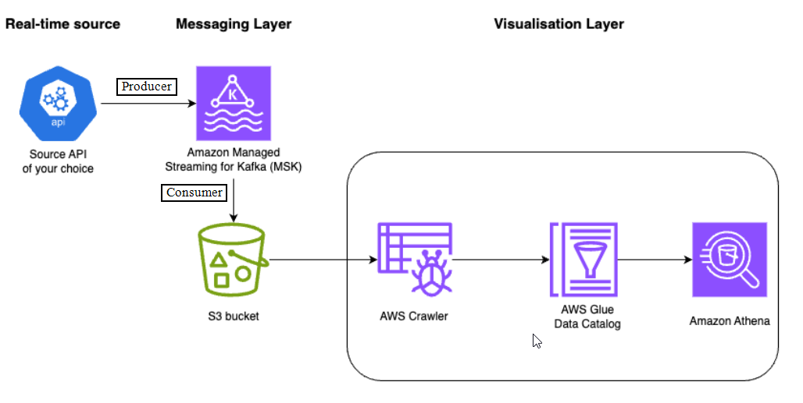
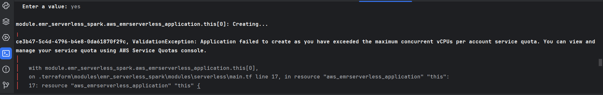
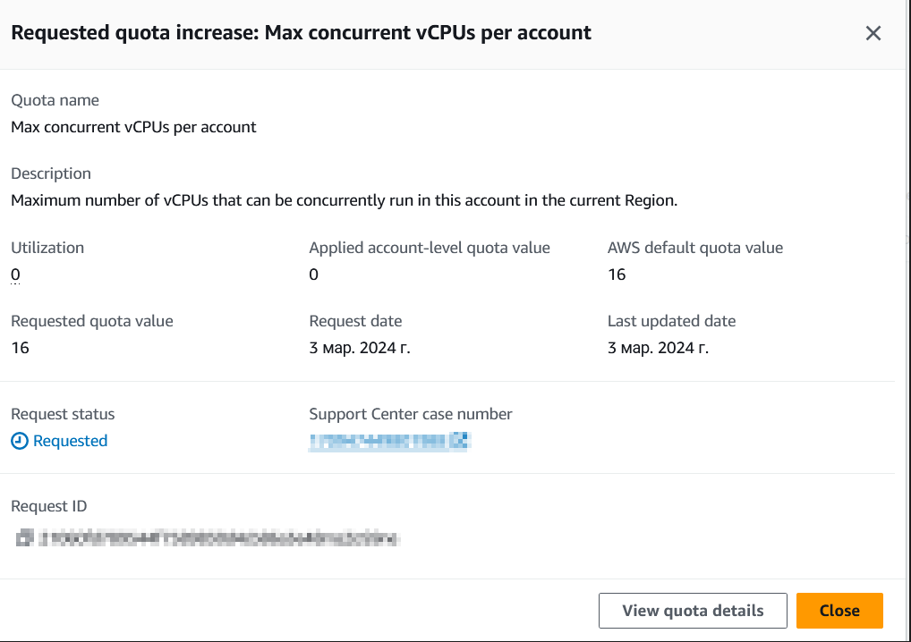
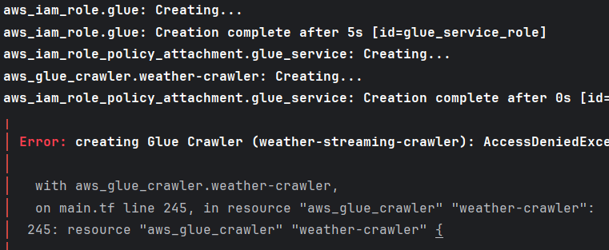
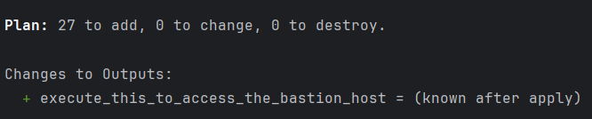
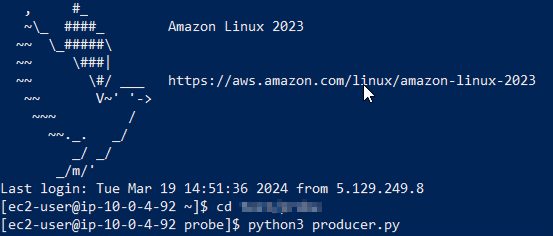
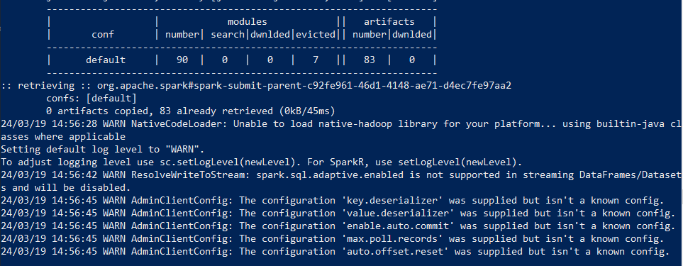
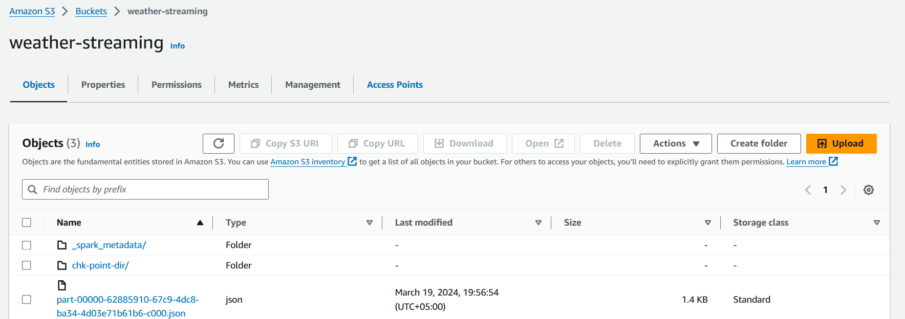

# Option 2 - Weather streaming pipeline with Amazon Athena to query results
## Project description
**Objective:** 
- Develop a streaming data pipeline that retrieves weather data from  [Weather API](https://www.weatherapi.com/).
- Produce this data in real-time to an Apache Kafka topic and build a Spark Streaming application to consume the records from Kafka.
- All of that must be deployed on AWS, leveraging infrastructure management using Terraform.
- Optionally, employ GitHub Actions to automate the deployment process

#### The project tech stack:
- [Python 3.8](https://www.python.org/downloads/)
- [AWS](https://aws.amazon.com/ru/)
- [Terraform](https://developer.hashicorp.com/terraform/downloads)
- [Apache Kafka](https://kafka.apache.org/)
- [Apache Spark](https://spark.apache.org/)

## Prerequisites for the project:

- Create an [AWS account](https://portal.aws.amazon.com/billing/signup?nc2=h_ct&src=header_signup&redirect_url=https%3A%2F%2Faws.amazon.com%2Fregistration-confirmation&language=ru_ru#/start/email)
- Install [Terraform](https://app.tango.us/app/workflow/Downloading-Terraform-on-Windows--A-Quick-Tutorial-63634416f09348c4857f64e3804235a2)
- Install [PyCharm](https://www.jetbrains.com/pycharm/download/)
- Clone `DataPipeLine-project` [repository](https://github.com/GAidaraliev/DataPipeLine-project.git) to your PyCharm project
- Install [AWS Cli](https://scriptcrunch.com/install-aws-cli-guide/)
- Configure [AWS Cli](https://scriptcrunch.com/install-aws-cli-guide/)
  - `aws configure`
  - `input your AWS Access Key ID` retrieve from AWS account -> My security credentials -> Create access key)
  - `input your AWS Secret Access Key` *as above*
  - `input your region` choose any appropriate region 

## Requirements
As the data pipeline utilizes an AWS virtual machine, all instructions for installing the necessary libraries will be provided in the section **Developer Guide**

## Design
It is a diagram which was chosen as a design to my data pipeline.\
As it can be seen below from the Architecture diagram, the system ingests data from real-time source (in my case - WeatherAPI) by producer which was deployed using Amazon Managed Streaming for Kafka (MSK) and transmits data to created `weather` topic.
After that the consumer receives data from kafka topic and stores them in AWS S3 bucket. 
Then AWS Glue Crawler is run to create a schema which is saved in AWS Glue Data Catalog. 
This schema will enable users to query the data as SQL queries using AWS Athena 

It should be mentioned that I also tried to deploy *option#1* but I've got an error.

That's why I choose another way, but I am still waiting for a solution to my request from AWS Support. However, I assume it is related with my `region problem` 



## Developer Guide
### Step by step data pipeline deployment guide
- Step 1: Open cloned repository with PyCharm
- Step 2: Navigate to the "IaC" directory
```bash
cd IaC
```
- Step 3: Deploy AWS infrastructure `AWS MSK, S3, Crawler` using Terraform
```bash
terraform init
terraform plan
terraform apply
```

```
As it was mentioned before, I have some troubles with AWS due to "my region".
That is why it's impossible for me to deploy `Glue Crawler`. 
```

```
However, it would not be a problem to illustrate my architecture design. 
More over I suppose that you will definitely be able to run all 27 resources on your machines.
```

*After 30 minutes you will see the following output:*
```
Apply complete! Resources: 27 added, 0 changed, 0 destroyed.
execute_this_to_access_the_bastion_host = "ssh ec2-user@x.xxx.xxx.xxx -i cert.pem"
```
*You probably have noticed as well a new file under your terraform folder, cert.pem. This is the private key that you need to use to access the bastion host. You can use the command provided in the output to access the bastion host.*
- Step 4: Connect to EC2 instance with the output command
```bash
ssh ec2-user@x.xxx.xxx.xxx -i cert.pem
```
- Step 5: Check your bootstrap servers
```
more bootstrap-servers
```
- Step 6: Create the `weather` topic *(input your bootstrap-server)*
```
kafka-topics.sh --bootstrap-server <your-bootstrap-server> --create --topic weather --partitions 6 --replication-factor 3
```
- Step 7: Install necessary packages
```
sudo yum install pip
sudo yum install git
```
- Step 8: Clone git repository to VM
```
git clone https://github.com/GAidaraliev/DataPipeLine-project.git
```
- Step 9: Navigate to git repository and install requirements
```
cd DataPipeLine-project
pip install -r requirements.txt
```
- Step 10: Start the Producer
  - Step 10.1: Input API key and bootstrap server *(aforementioned)* using Vi editor
    ```
    vi producer.py
    ```
  - Step 10.2: Launch the Producer
    ```
    python3 producer.py 
    ```
*The producer will start to generate real-time data and send it to the created topic*


- Step 11: Open a new terminal, repeat `Step 4` and set up `SPARK_HOME` environment variable
```
export SPARK_HOME=/spark-3.5.1-bin-hadoop3
```
- Step 12: Start the Consumer
  - Step 12.1: Input AWS credentials and bootstrap server using VI editor
  ```
  vi kafka_commons.py
  ```
  - Step 12.2: Launch the Consumer
  ```
  python3 consumer.py
  ```
*The consumer will start to receive real-time data from kafka topic and deliver it to the S3 bucket `weather-streaming` in json format* 



- Step 13: Run AWS Clue Crawler
```
As we have implemented AWS Clue Crawler in Terraform, you can find it in AWS Glue -> Crawlers. 
Unfortunately, I cannot provide a screenshot as I have been denied access to this service
```
- Step 14: Launch Athena
```
Open AWS Athena query editor and choose the `weather-database` (created in Terraform) and write any SQL query for getting defined weather results.
```
- The final words 
```
Honestly, the chosen case may be seemed to be slightly simple in spite of my efforts to create a complicated one and it's definetely my current hard skills leave much to be desired. 
However, I suppose that this project is worth to be presented.
```
# Author
Gali Aydaraliev\
gali.aydaraliev@edu.dsti.institute


